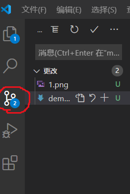
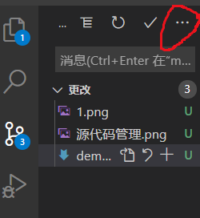

# markdown/Github使用
## 准备工具
* vscode下载插件Markdown Preview Enhanced
* 注册GitHub，且建立仓库
## 使用方法
1 建立新的github仓库

2  复制仓库的远程地址，并且复制下来

3 在vscode中按下shift+ctrl+p 输入命令git clone 加上GitHub的远程地址 回车 把仓库下载更新到本地

4 vscode安装了Markdown Preview Enhanced之后在右上角有一个"打开侧边预览"的选项,点击它就可以预览markdown写的文档。

5 把本地的数据上传到GitHub远程仓库中：

    1 打开左边栏的第三个，源码管理，在里面说明这次你修改了很么内容，按下ctrl+enter，确认并提交。

    

    2 如图选择右侧的三个点，... ，选择推送，即可提交到远程仓库
 